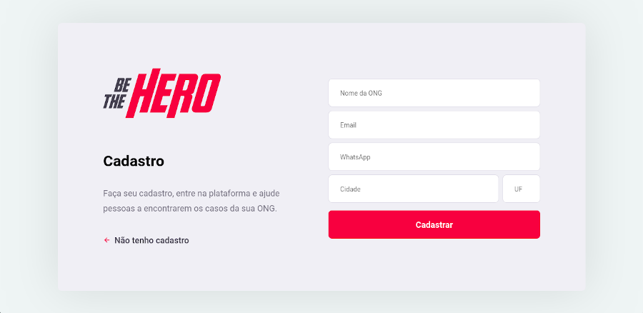
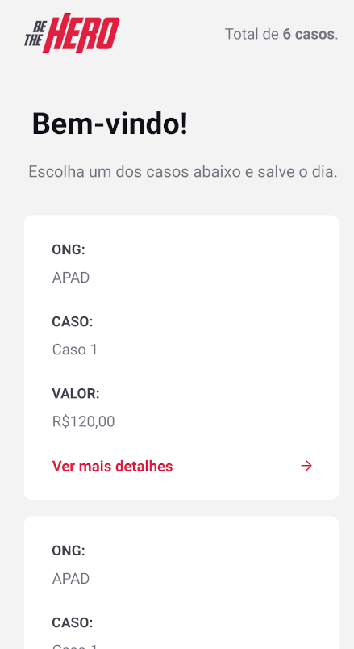

  
  
Connect people to ONGs <strong>be a hero!</strong>

## 💡 Project 

Aplication created in 11ª edition of the Semana OmniStack, the application have the purpose to help ONGs.

This application was created in one week domining front end, back and mobile using JavaScript.

[Layout](https://www.figma.com/file/2C2yvw7jsCOGmaNUDftX9n/Be-The-Hero---OmniStack-11?node-id=0%3A1) application in figma.

## 💻 Screenshots

<table>
	<tr>
		<th width="50%">
			Web Interface 
		</th>
		<th width="50%">
			Web Register page 
		</th>
	</tr>	
	</tr>
	<tr>
		<td>
			
		</td>
		<td>
			
		</td>
	</tr>
</table>

<table>
	<tr>
		<th width="50%">
			App Splash 
		</th>
		<th width="50%">
			App Interface 
		</th>
	</tr>	
	</tr>
	<tr>
		<td>
			
		</td>
		<td>
			
		</td>
	</tr>
</table>

## 🧾 Features

* The ONGs may login in the application and register.
* The ONGs may disponibilize their contact.
* The user will see the cases and contact the ong for more informations.

## 🛠 Tools 

- [React](https://reactjs.org/)
- [React Native](http://reactnative.dev/)
- [Node.js](https://nodejs.org/en/docs/)
- [Express](http://expressjs.com/)
- [Knex](http://knexjs.org/)
